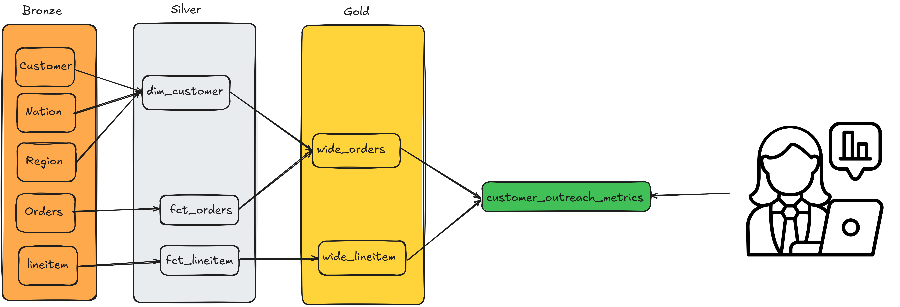

* [Build a data engineering project, with step-by-step instructions](#build-a-data-engineering-project-with-step-by-step-instructions)
     * [Data used](#data-used)
     * [Architecture](#architecture)
     * [Setup](#setup)
          * [Option 1: Github codespaces (Recommended)](#option-1-github-codespaces-recommended)
          * [Option 2: Run locally](#option-2-run-locally)

# Build a data engineering project, with step-by-step instructions

* Code for the blog: **[Build data engineering projects with step-by-step instruction](https://www.startdataengineering.com/post/de-proj-step-by-step/)**
* **Live workshop link**

  [](https://www.youtube.com/live/bfiOLwp1aWM)


## Data used 

Let's assume we are working with a car part seller database (tpch). The data is available in a duckdb database. See the data model below:


We can create fake input data using the [create_input_data.py](https://github.com/josephmachado/de_project/blob/main/setup/create_input_data.py).

## Architecture

Most data teams have their version of the 3-hop architecture. For example, dbt has its own version (stage, intermediate, mart), and Spark has medallion (bronze, silver, gold) architecture.



**Tools used:**

1. [](https://pola.rs/)
2. [](https://www.docker.com/)
3. [](https://airflow.apache.org/)
4. [](https://docs.pytest.org/en/stable/)
5. [](https://duckdb.org/)

## Setup

You have two options to run the exercises in this repo

### Option 1: Github codespaces (Recommended)

Steps:

1. Create [Github codespaces with this link](https://github.com/codespaces/new?skip_quickstart=true&machine=basicLinux32gb&repo=858828036&ref=main&devcontainer_path=.devcontainer%2Fdevcontainer.json&geo=UsWest).
2. Wait for Github to install the [requirements.txt](./requirements.txt). This step can take about 5minutes.
        
3. Now open the `setup-data-project.ipynb` and it will open in a Jupyter notebook interface. You will be asked for your kernel choice, choose `Python Environments` and then `python3.12.00 Global`.
        
4. The **[setup-data-project](./setup-data-project.ipynb)** notebook that goes over how to create a data pipeline.
5. In the terminal run the following commands to setup input data, run etl and run tests.

```bash
# setup input data
python ./setup/create_input_data.py
# run pipeline
python de_project/run_pipeline.py
# run tests
python -m pytest de_project/tests/unit/test_dim_customer.py
```

### Option 2: Run locally

Steps:

1. Clone this repo, cd into the cloned repo
2. Start a virtual env and install requirements.
3. Start Jupyter lab and run the `setup-data-project.ipynb` notebook that goes over how to create a data pipeline.
```bash
git clone https://github.com/josephmachado/de_project.git
cd de_project 
python -m venv ./env # create a virtual env
source env/bin/activate # use virtual environment
pip install -r requirements.txt
jupyter lab
```
4. In the terminal run the following commands to setup input data, run etl and run tests.

```bash
# setup input data
python ./setup/create_input_data.py
# run pipeline
python de_project/run_pipeline.py
# run tests
python -m pytest de_project/tests/unit/test_dim_customer.py
```

